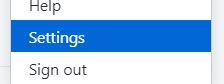
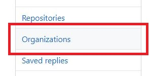
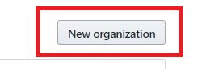
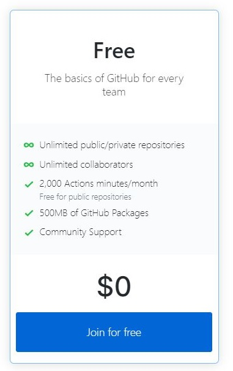
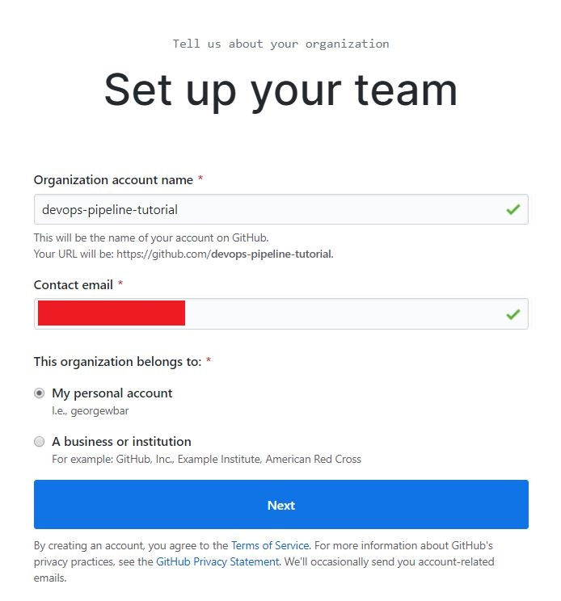
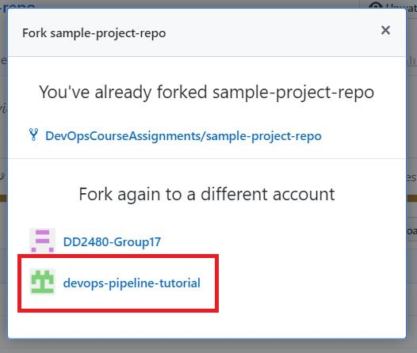
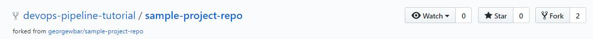

# Create Github Organization and Fork repo to it.
Now, we will use one of the two Github accounts that you have. This account will have the `admin` rights of the repo that will be forked later to the organization that we will create now. Let's call this user `<GITHUB_ADMIN_USER>`. The `<GITHUB_ADMIN_USER>` that I will use in this tutorial to demonstrate the concepts is `georgewbar`. From now on, `<GITHUB_ADMIN_USER>`=`georgewbar`.

We will need an organization to be able to control the access writes to different users in a more flexible manners.

# Create Github Organization
Now, do the following steps (and the screenshots) to create a new organization:

1. Sign in to your `<GITHUB_ADMIN_USER>` account.

1. Click on your profile icon in the upper right part of your screen. Then, select `Settings`.  

1. Click on `Organizations` on the left.

1. Click on `New organization` on the top left right.

1. Click on `Join for free` on the left.

1. Fill in the required information in the form:

  * `<ORGANIZATION ACCOUNT NAME>`: write an organization name that is not already taken. For our example here, I chose `devops-pipeline-tutorial`.
  * `<CONTACT EMAIL>`.
  * Then, choose that this organization belongs to `My personal account`.
  * Then, click `Next`.

  

1. Click on `Skip this step` to skip adding collaborators for now until we have setup the organization and repo appropriately.

# Fork the Github repo
1. Now, go to this Github repo [https://github.com/georgewbar/sample-project-repo](https://github.com/georgewbar/sample-project-repo) and click on `Fork` on the top right.

1. Now, a form will come up asking you whether you want to fork the repo. Choose to fork the repo to the organization that you created in the above steps (in other words, to the organization with name `<ORGANIZATION ACCOUNT NAME>`; in my case, `<ORGANIZATION ACCOUNT NAME>`=`devops-pipeline-tutorial`).

From now on, you will work on the fork in your organization, and I will work on my fork in `devops-pipeline-tutorial` as seen below.

