# Configure Jenkins

Now, we will go back to Jenkins to configure it to have a `Multibranch Pipeline`. Then, we will add a webhook to Github so that Github notifies Jenkins when something interesting happens in Github, such as when a push happens to Github and when a new branch is created/deleted. In the steps mentioned here, we will the `personal access token` that we created on Github.

## Create a Multibranch Pipeline

Do the following steps:

1. Go to this URL https://[[HOST_SUBDOMAIN]]-8080-[[KATACODA_HOST]].environments.katacoda.com/, and log in (if you are not already logged in) using the `<USERNAME>` created in `Step 1` in this tutorial.

1. When you have logged in, click on `New Item` on the left part of the screen.  
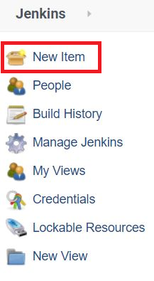

1. A new form will appear. Type in the item name (call it `<ITEM NAME>`). I will choose `<ITEM NAME>`=`sample-project-pipeline`.  
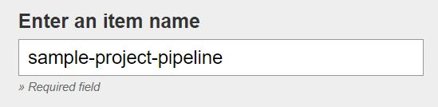

1. Then, choose the item type `Multibranch Pipeline`. Then, click `OK`.  
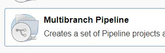

1. A new form will appear. Fill in the `Display Name` in the top to be `Sample Maven Pipeline`.  
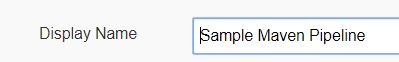

1. Then, go to `Branch Sources`, and click on `Add source`.  
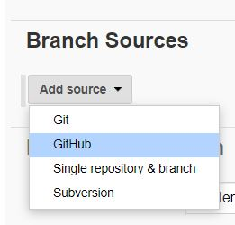

1. Then, add a new `Credential` by clicking `Add` and choose `sample-project-pipeline`.  
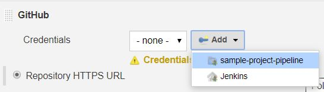

1. A new form will appear. Fill in the details:
  * `Kind`: `Username with password`.
  * `Username`: your Github admin username `<GITHUB_ADMIN_USER>` that was used in Step 2 in the Katacoda tutorial. In my case, `<GITHUB_ADMIN_USER>`=`georgewbar` as mentioned in Step 2.
  * `Password`: Here, you will use the `Personal access token` that you created in Step 3. As you remember, we saved the token in a file name `token`. Execute `cat token`{{execute}} in the Katacoda terminal. This will show the token in the terminal. Select this token in the terminal and right click and select copy. Then, paste this token in the `Password` field.
  * `ID`: Write a meaningful name for the token credentials here. I wrote `github-token`.  

  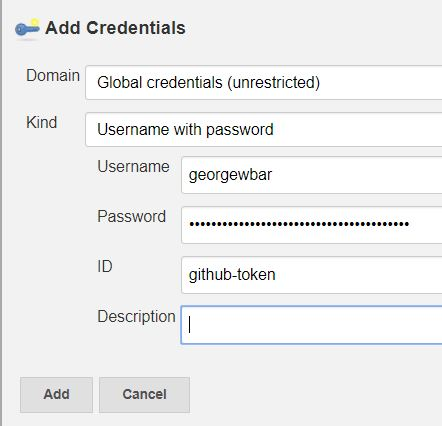

1. Then, in a new browser tab, go to the URL of the repo fork `https://github.com/<ORGANIZATION ACCOUNT NAME>/sample-project-repo`{{copy}}, where `<ORGANIZATION ACCOUNT NAME>` is your organization account name. In my case, the URL is `https://github.com/devops-pipeline-tutorial/sample-project-repo`. Then, click `Clone or download`. Then, click `Use HTTPS` if `Clone with HTTPS` is not seen. Then, click on the `Copy to clipboard` sign to copy the repo URL.  


1. Then, go back to Jenkins, and select the credentials that you created and paste the repo URL that you copied in the previous step, and click on validate. It should tell you `Credentials ok. Connected to https://github.com/<ORGANIZATION ACCOUNT NAME>/sample-project-repo`, where `<ORGANIZATION ACCOUNT NAME>` is your organization account name. In my case, the end result looks like this (and it should look similar in your case except with different `<GITHUB_ADMIN_USER>` and `<ORGANIZATION ACCOUNT NAME>`):
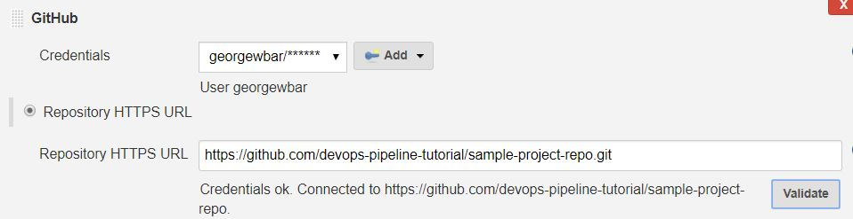

1. Now, select the `Discover branch` strategy to be `All branches` to discover all branches.  
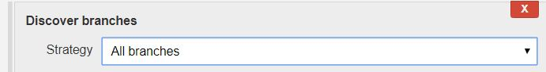

1. Now go to the bottom of the page, and click `Save`.  


Now, Jenkins will search all the branches on your organization's repo fork on Github, index them, and create separate projects on Jenkins for each branch under the parent project `Sample Maven Pipeline` that was created. Not only that, but Jenkins also will search for a file called `Jenkinsfile` on every branch to use to create a pipeline for each branch. If you go to your repo fork, you will see a file called `Jenkinsfile` on the `master` branch, which is the only branch we have for now.

### Explanation: What is `Jenkinsfile`?
`Jenkinsfile` is a file that defines the configurations and stages that a pipeline should have. Jenkins uses file to create a pipeline with the defined configurations and stages when Jenkins is notified with a code change or even when Jenkins is manually to told build the project on the Github repo at any moment. That is why using a file to define a pipeline is called `Pipeline as Code`.

`Jenkinsfile` can be defined using two different syntaxes: `Declarative` and `Scripted` Pipeline. In this tutorial, the `Jenkinsfile` defined in the repo use a `Declarative` pipeline.

Let's look at the `Declarative` pipeline defined using the `Jenkinsfile` in the repo, and clarify its components.

```
pipeline {
    agent {
        docker {
            image 'maven:3-alpine'
        }
    }
    options {
        skipStagesAfterUnstable()
    }
    stages {
        stage('Build') {
            steps {
                sh 'mvn -B -DskipTests clean package'
            }
        }
        stage('Test') {
            steps {
                sh 'mvn test'
            }
            post {
                always {
                    junit 'target/surefire-reports/*.xml'
                }
            }
        }
        stage('Deliver') {
            steps {
                sh 'mvn -DskipTests install'
            }
            post {
                success {
                    archiveArtifacts artifacts: 'target/*.jar', fingerprint: true
                }
            }
        }
    }
}
```

* The definition of pipeline begins with `pipeline` element.

* Then, inside the `pipeline` element, we define a global `agent` that all the stages defined under `stages` are executed in. There is also the ability to execute different stages in different agents. However, in our case here, we use one global agent for all the stages. The `agent` that we define here is a `docker` agent. This means that Jenkins will run a `docker` container and execute all the stages inside that container. In our case here, we will use the `docker` `image maven:3-alpine` to create the container for executing the stages inside it. This facilitates the execution of the pipeline in separate and consistent environments, which will lead to e.g. less problems regarding the application dependencies.

* The `skipStagesAfterUnstable()` inside `options` will make pipeline abort with failure if any of the stages are marked as unstable. This will make the pipeline abort (in the pipeline's terms, this will make the pipeline skip the following stages, which includes only the `Deliver` stage in our case here) if the `Test` stage had failing tests or was unstable.

* `stages` element has sub-elements of type `stage`, which are the stages the pipeline should consist of. Each stages consists of one or more steps that are defined under `steps` element.

  * Here, we have a `Build` stage, which will execute the bash command (indicated by `sh`) `mvn -B -DskipTests clean package`, which will run maven clean and package phases without tests to see if the application will build successfully or not.

  * If `Build` stage was successful, the `Test` stage will be executed, which will run the unit tests. Here, we have `post` element, which indicates some steps to execute at the end of the stage on certain conditions. Here the `post` element is `always` executed. The steps under `always` is of type `junit`, which is uses JUnit plugin. This step archives the unit tests XML report that is produced as a result of running `mvn test`. When Jenkins archives something, it makes easily accessible/available from Jenkins interface.

  * If `Test` stage was successful, the `Deliver` stage will be executed. This stage will install the JAR file to the local maven repo on your katacoda environment. If this was successful, the `post` actions will take place, which will make Jenkins archive the Jar file, which will make it easily accessible/available from Jenkins interface.

## After saving the Multibranch Pipeline

Do the following steps:

1. Go to Jenkins home by clicking on Jenkins logo on the top left.  
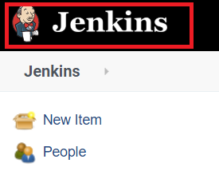

1. You will see the Multibranch pipeline called `Sample Maven Pipeline` that was created with a sunny symbol, which shows the aggregated status of recent builds. Click on `Sample Maven Pipeline`.  
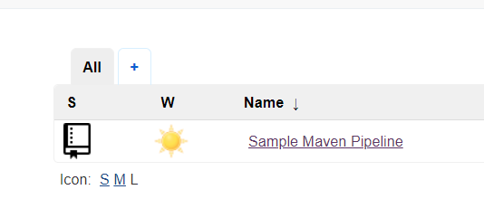

1. Now you will the different branches in the Github repo fork, which only includes `master` for now. Click on `master` branch.
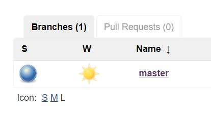

1. Now you will see branch master builds, which only includes one build only `#1`. You can also see `Last successful artifacts` which has `tutorial-1.0-SNAPSHOT.jar` element underneath. You can click to download this JAR file if you want. It also shows `Latest Test Result (no failures)`. You can click on any of elements shown to show more details. For now, click on `#1` element.
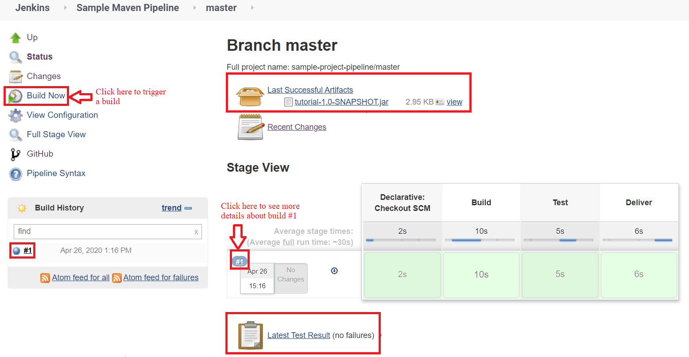

1. Now you will see a new page that has more details about build `#1` specifically. You will see the archived `Build artifacts` (and the `tutorial-1.0-SNAPSHOT.jar` file artifact underneath it) that are specific to build `#1`, and `Test Result` (which shows `no failures`) that are also specific to build `#1`. You will also see `Console Output` on the left which will show you the detailed log output of build `#1`. You will also see the branch of this build, which is `master` branch in this case. You could click on any of these elements to see more details.  
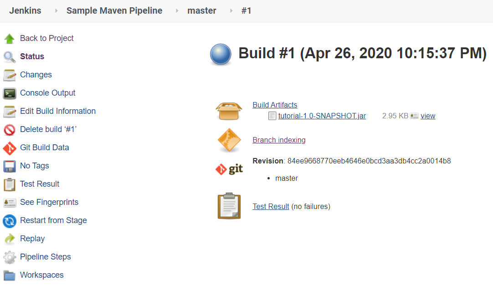
