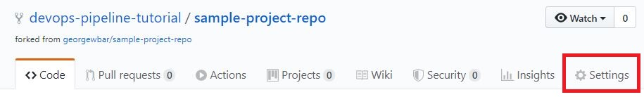
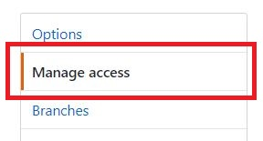
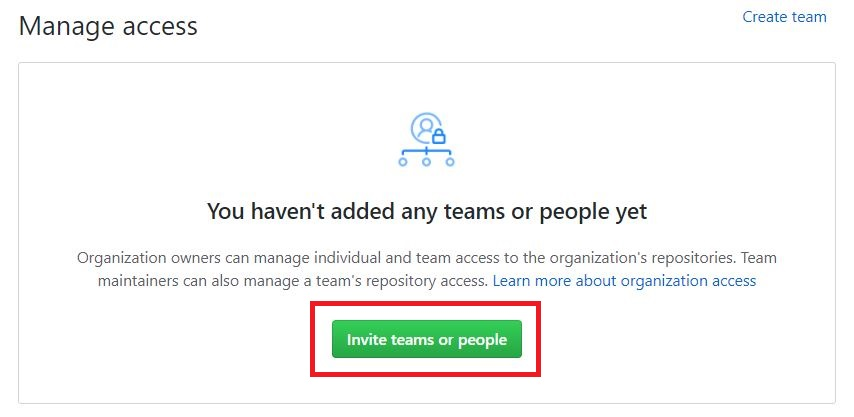
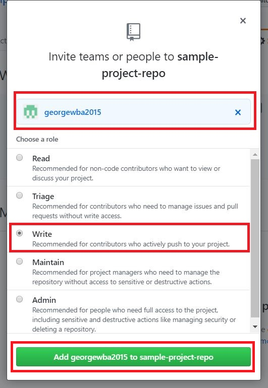
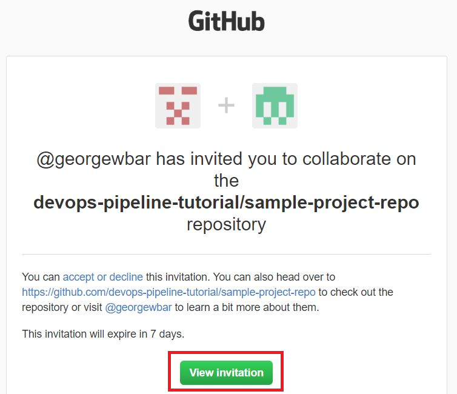

# Invite a collaborator with `Write` access

Now we are going to add a new Github collaborator to your organization's Github repo fork. Call this new Github collaborator `<GITHUB_WRITE_USER>`. In my case here, `<GITHUB_WRITE_USER>`=`georgewba2015`.

(As a reminder, the admin Github in my case is `<GITHUB_ADMIN_USER>`=`georgewbar`)

Also, from now on, we will call the current browser that you have open right now `Browser_Admin`

Do the following steps:

1. Now, in `BrowserAdmin`, go to your organization's repo fork `https://github.com/<ORGANIZATION ACCOUNT NAME>/sample-project-repo`{{copy}} (and sign in as `<GITHUB_ADMIN_USER>` if you are not already), where `<ORGANIZATION ACCOUNT NAME>` is replaced by your organization's account name. In my case, this URL is `https://github.com/devops-pipeline-tutorial/sample-project-repo`. Then, click on your repo settings.

1. Then, click on `Manage access` on the left.  

1. Then, click on `Invite teams or people`.  

1. Now, a new form will appear. Fill in the collaborator Github account name `<GITHUB_WRITE_USER>`. In my case, `<GITHUB_WRITE_USER>`=`georgewba2015`. Then, under `Choose a role`, select `Write`. Then, click on `Add <GITHUB_WRITE_USER> to sample-project-repo`.  

1. By now, an invitation email should have been sent to the email associated with the `<GITHUB_WRITE_USER>` account.

1. Now, open another browser or an incognito browser (call it `Browser_Write`). Then, in `Browser_Write`, first sign in to your `<GITHUB_WRITE_USER>` Github account.

1. Then, in `Browser_Write`, open a new tab and sign in to the email associated with `<GITHUB_WRITE_USER>`. You should have gotten an invitation similar to the email you see below (except that `devops-pipeline-tutorial/sample-project-repo` is replaced with `<ORGANIZATION ACCOUNT NAME>/sample-project-repo`). Click on `View invitation`.

1. This will open a new page. Click on `Accept invitation`. Note that, in the image, `georgewbar` is replaced by `<GITHUB_ADMIN_USER>`.

Now, `<GITHUB_WRITE_USER>` user should have `Write` access to the repo fork  `<ORGANIZATION ACCOUNT NAME>/sample-project-repo`.
