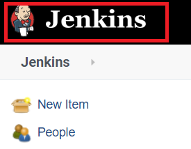
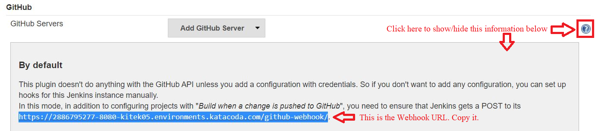

# Configure Github webhook and branch rules

Now, we will configure repo fork on Github to have a webhook URL of Jenkins that Github can use to notify Jenkins that something has changed on the Github repo fork.

Then, we will add a branch rule to Github that will make no one except `<GITHUB_ADMIN_USER>` be able to push to the `master` branch directly or be able to merge any branch to `master` without both passing on Jenkins first and getting a review from at least one other reviewer.

Let's take it step by step.

## Configure Github webhook

Do the following steps:

1. In order to know the Jenkins URL that can be used as a webhook by Github to notify Jenkins of changes, we need to go to Jenkins first. So, first log in to your Jenkins instance again if you are not logged in already.

1. When you have logged in, go to Jenkins home page by clicking on Jenkins logo on the top left.  

1. Then, click on `Manage Jenkins` on the left part of the screen.  

1. Then, click on `Configure System`.  

1. A new page will appear. Scroll down until you find a section called `Github`. Click on the blue `?` (help) icon to show more information about this section. This will show you the webhook URL of Jenkins that Github can use (marked in blue in the image). Copy the URL.  

1. Now go to your organization's repo fork `https://github.com/<ORGANIZATION ACCOUNT NAME>/sample-project-repo`{{copy}} (and sign in as `<GITHUB_ADMIN_USER>` if you are not already), where `<ORGANIZATION ACCOUNT NAME>` is replaced by your organization's account name. In my case, this URL is `https://github.com/devops-pipeline-tutorial/sample-project-repo`. Then, click on your repo `Settings`.  

1. Then, click on `Webhooks` on the left.  

1. Then, click on `Add webhook` on the right.  

1. Then, paste the webhook URL that you copied in a previous step in `Payload URL` field. Then, select `application/json` as the `Content type`.  

1. Then, under `Which events would you like to trigger this webhook?`, select `Let me select individual events` option.  

1. A number of options will appear. Select the following `events` from them:
  * `Branch or tag creation`.  
  
  * `Branch or tag deletion`.  
  
  * `Pull requests`.  
  
  * `Pushes`.  
  
  * `Statuses`.  
  

1. Then, at the bottom of the page, click on the green button called `Add webhook`.

Now, you have added a webhook.

## Configure a rule for `master` branch.

Do the following steps:

1. Now go to your organization's repo fork `https://github.com/<ORGANIZATION ACCOUNT NAME>/sample-project-repo`{{copy}}, where `<ORGANIZATION ACCOUNT NAME>` is replaced by your organization's account name. In my case, this URL is `https://github.com/devops-pipeline-tutorial/sample-project-repo`. Then, click on your repo `Settings`.  

1. Then, click on `Branches` on the left.  

1. Then, click on `Add rule` on the right.  

1. A form will appear. Type `master` under `Branch name pattern`.  

1. Now, select the following options:
  * `Require pull request reviews before merging`.
    * `Required approving reviews: 1`.
    * `Dismiss stale pull request approvals when new commits are pushed`.
  * `Require status checks to pass before merging`
    * `continuous-integration/jenkins/branch`.

  

1. Then, click on `Create` button at the bottom.  

Now, you have added a branch rule for `master` branch.
