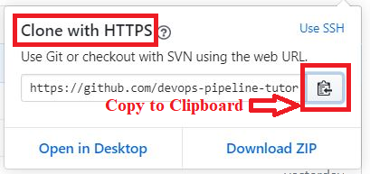
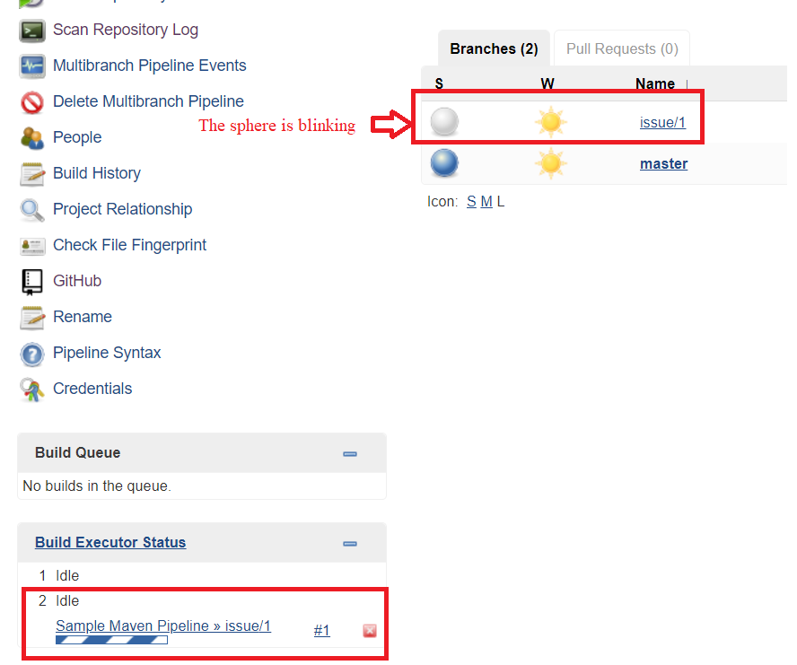
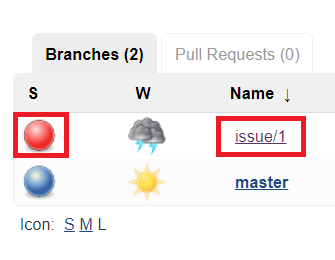
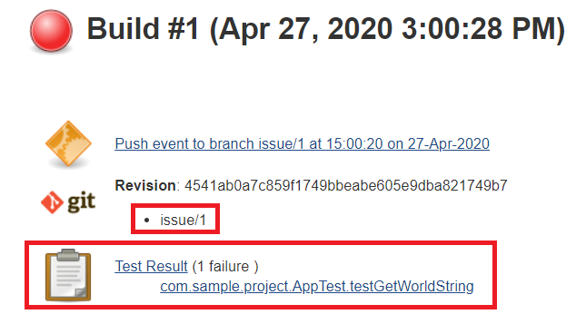
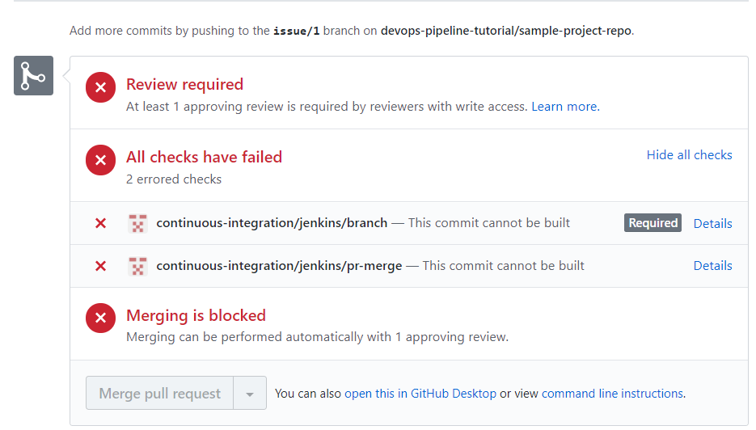

# Clone the repo fork, introduce an error, push and create a pull request

Let's proceed.

## Clone repo fork
Now, we are going to clone you organization's repo fork, introduce an error and push it to Github on a new branch that we will call `issue/1` using `<GITHUB_WRITE_USER>` account (note that: we are going to use `<GITHUB_WRITE_USER>` and not `<GITHUB_ADMIN_USER>`) to demonstrate that Github is able to notify Jenkins server on https://[[HOST_SUBDOMAIN]]-8080-[[KATACODA_HOST]].environments.katacoda.com/ with the changes made to the Github repo.

Do the following steps:

1. In `Browser_Admin`, as mentioned before, you have three tabs already open: one tab for your `<GITHUB_ADMIN_USER>` account on Github, one tab for Katacoda tutorial, and one tab for the Jenkins server via URL https://[[HOST_SUBDOMAIN]]-8080-[[KATACODA_HOST]].environments.katacoda.com/.

1. Now, in `BrowserAdmin`, go to your organization's repo fork `https://github.com/<ORGANIZATION ACCOUNT NAME>/sample-project-repo`{{copy}} (and sign in as `<GITHUB_ADMIN_USER>` if you are not already), where `<ORGANIZATION ACCOUNT NAME>` is replaced by your organization's account name. In my case, this URL is `https://github.com/devops-pipeline-tutorial/sample-project-repo`. Then, click `Clone or download`. Then, click `Use HTTPS` if `Clone with HTTPS` is not seen. Then, click on the `Copy to clipboard` sign to copy the `repo URL`.  


1. Now, go to the terminal in the Katacoda tutorial, and execute `git config --global user.email "<GITHUB_WRITE_USER email>"`{{copy}}, where `<GITHUB_WRITE_USER email>` should be replaced by the email associated with `<GITHUB_WRITE_USER>` account. For example, if `<GITHUB_WRITE_USER email>`=`abc@examplesite.com`, then the command shoudl be `git config --global user.email "abc@examplesite.com"`.

1. Now, execute `git clone <repo URL>`, where URL is the URL copied in previous step. In my case, I will execute `git clone https://github.com/devops-pipeline-tutorial/sample-project-repo.git`. Note that thr URL that you will use in the `git clone` command is different from the one I am using here. The command that you will execute will be of the form `git clone https://github.com/<ORGANIZATION ACCOUNT NAME>/sample-project-repo.git`{{copy}}, where `<ORGANIZATION ACCOUNT NAME>` is your organization's account name.

1. Now execute `cd sample-project-repo/`{{execute}} to in your repo folder.

## Some notes about the repo fork

Now, it is worth going briefly through the most important files in this project. We have the following files:
```bash
.
├── Jenkinsfile
├── pom.xml
├── README.md
└── src
    ├── main
    │   └── java
    │       └── com
    │           └── sample
    │               └── project
    │                   └── App.java
    └── test
        └── java
            └── com
                └── sample
                    └── project
                        └── AppTest.java
```
* `Jenkinsfile` file: defines Jenkins Multibranch pipeline as mentioned before.
* `pom.xml` file: defines the dependencies and plugins of the maven project, for example JUnit dependency and plugins for packaging, testing and installing the project.
* `src/main/java/com/sample/project/App.java` file: contains two methods and a main static method for printing "Hello World".
```java
public class App
{
    public static void main( String[] args )
    {
        System.out.println(getHelloString() + " " + getWorldString());
    }
    public static String getHelloString(){
        return "Hello";
    }
    public static String getWorldString(){
        return "World";
    }
}
```
* `src/test/java/com/sample/project/AppTest.java` file: contains two unit test methods that the two method `getHelloString` and `testGetWorldString` returns `"Hello"` and `"World"` respectively.
```java
public class AppTest
{
    @Test
    public void testGetHelloString()
    {
        assertEquals("Hello", App.getHelloString());
    }
    @Test
    public void testGetWorldString()
    {
        assertEquals("World", App.getWorldString());
    }
}
```

What we want to do now is to demonstrate that if any of the unit tests fail, then Jenkins pipeline will detect that and will send a `failure` status to Github.

## Now, we introduce a unit test error and push

We will demonstrate that if any of the unit tests fail, then Jenkins pipeline will detect that and will send a `failure` status to Github. We will do this by changing the `return "World";` in `App.java` file to `return "Worl";` (we will omit the letter `d` in the word `"World"` to simulate a bug in our code).

Do the following steps:

1. Now, execute `pwd`{{execute}}, and make sure that the output is `<ANY PATH>/sample-project-repo`, where `<ANY PATH>` indicates any path.

1. Now, execute `git checkout -b issue/1`{{execute}} to create a new branch `issue/1` and switch to it.

1. Now execute `sed -i 's/return \"World\"/return \"Worl\"/g' ./src/main/java/com/sample/project/App.java`{{execute}}. This will replace the world `return "World"` with `return "Worl"` in the `App.java` file.

1. Now execute `cat ./src/main/java/com/sample/project/App.java`{{execute}}. This will show you the content of `App.java` file. You should see an output similar to this.
```java
public class App
{
    public static void main( String[] args )
    {
        System.out.println(getHelloString() + " " + getWorldString());
    }
    public static String getHelloString(){
        return "Hello";
    }
    public static String getWorldString(){
        return "Worl";
    }
}
```

1. Now, execute `git add .`{{execute}}, and then `git commit -m "Edit getWorldString method"`{{execute}}.

1. Now, execute `git push -u origin issue/1`{{execute}} to push the new code to the Github repo fork. The terminal will ask you to enter a github username. Type in your `<GITHUB_WRITE_USER>` account name (**Observe that:** we are pushing the code using `<GITHUB_WRITE_USER>` and not `<GITHUB_ADMIN_USER>`). In my case, `<GITHUB_WRITE_USER>`=`georgewba2015`. So, I will type `georgewba2015`. It will then ask you for the password. Type in the password of `<GITHUB_WRITE_USER>` account.

1. If the username and password are correct, the new code will be pushed to a new branch called `issue/1` on Github. After some time, this should trigger Jenkins to checkout the code and build the pipeline.

1. Now, go to the Jenkins server page https://[[HOST_SUBDOMAIN]]-8080-[[KATACODA_HOST]].environments.katacoda.com/job/sample-project-pipeline/. After some time, refresh the page. You should see that Jenkins detected a new push and a new branch `issue/1`.  


1. After some time, when Jenkins is done, refresh the page. The sphere beside `issue/1` branch should be red indicating that the pipeline failed. Now, click on `issue/1`.  


1. Now, you will see the failing pipeline. You will see that the `Test` and `Deliver` stages failed. To see more details, click on `#1`.  


1. Now, you will that there is one test failure and the method that failed is called `testGetWorldString`. You also see no artifacts, because the `Test` stage failed, and this made Jenkins skip the `Deliver` stage. You also the branch that this build is about, which is `issue/1` branch. To see more details about the test results, click on the link `Test Result`.


1. Now, you will see more details about the tests. There is a total of 2 tests and 1 failure. You can also see the failed tests, and you could click on any of the links to see more details.  


1. Now, go to `https://github.com/<ORGANIZATION ACCOUNT NAME>/sample-project-repo/tree/issue/1`. You will see that a `failure` status in latest commit status.  


## Create a pull request
1. Now, go to the other browser `Browser_Write` to see pull request from `<GITHUB_WRITE_USER>` account perspective. Then, go to `https://github.com/<ORGANIZATION ACCOUNT NAME>/sample-project-repo`{{copy}}. Now, we will create a pull request using `<GITHUB_WRITE_USER>` account.

1. Click on `Pull requests` at the top. Then click on `New pull request`.  


1. Then, choose `<ORGANIZATION ACCOUNT NAME>/sample-project-repo` as your base repo. In my case here, I chose `devops-pipeline-tutorial/sample-project-repo` as my base repo. Then, click on `Create pull request` button.


1. After some time, you should see something similar to this.  


We will need to fix what we broke, and push the new code again, and use  `<GITHUB_ADMIN_USER>` to review the code after Jenkins has notified Github it was able to build a successful pipeline.
