# Fix the error, push again, and review

Do the following steps:

1. In `Browser_Admin`, as mentioned before, you have three tabs already open: one tab for your `<GITHUB_ADMIN_USER>` account on Github, one tab for Katacoda tutorial, and one tab for the Jenkins server via URL https://[[HOST_SUBDOMAIN]]-8080-[[KATACODA_HOST]].environments.katacoda.com/.

1. Now, go to the terminal in the Katacoda tutorial, and execute `pwd`{{execute}}, and make sure that the output is `<ANY PATH>/sample-project-repo`, where `<ANY PATH>` indicates any path.

1. Now execute `sed -i 's/return \"Worl\"/return \"World\"/g' ./src/main/java/com/sample/project/App.java`{{execute}}. This will replace the world `return "Worl"` with `return "World"` in the `App.java` file to fix the error that we introduced in Step 7.

1. Now execute `cat ./src/main/java/com/sample/project/App.java`{{execute}}. This will show you the content of `App.java` file. You should see an output similar to this.
```java
public class App
{
    public static void main( String[] args )
    {
        System.out.println(getHelloString() + " " + getWorldString());
    }
    public static String getHelloString(){
        return "Hello";
    }
    public static String getWorldString(){
        return "World";
    }
}
```

1. Now, execute `git add .`{{execute}}, and then `git commit -m "Fix getWorldString method"`{{execute}}.

1. Now, execute `git push -u origin issue/1`{{execute}} to push the new code to the Github repo fork. The terminal will ask you to enter a github username. Type in your `<GITHUB_WRITE_USER>` account name (**Observe that:** we are pushing the code using `<GITHUB_WRITE_USER>` and not `<GITHUB_ADMIN_USER>`). In my case, `<GITHUB_WRITE_USER>`=`georgewba2015`. So, I will type `georgewba2015`. It will then ask you for the password. Type in the password of `<GITHUB_WRITE_USER>` account.

1. If the username and password are correct, the new code will be pushed to a new branch called `issue/1` on Github. After some time, this should trigger Jenkins to checkout the code and build the pipeline.

1. Now, go to the Jenkins server page https://[[HOST_SUBDOMAIN]]-8080-[[KATACODA_HOST]].environments.katacoda.com/job/sample-project-pipeline/. After some time, refresh the page. You should see that Jenkins detected a new push to branch `issue/1`.  
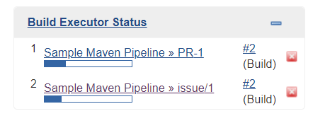

1. After some time, when Jenkins is done, refresh the page. The sphere beside `issue/1` branch should be green now instead indicating that the pipeline successful. Now, click on `issue/1`.  
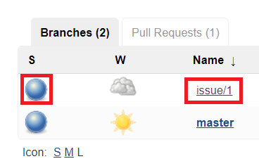

1. Now you should see that there are two build `#1` and `#2` for branch `issue/1`. You will also notice that build `#2` is now successful. You will also see that an artifact was also built because build `#2` was now successful.  
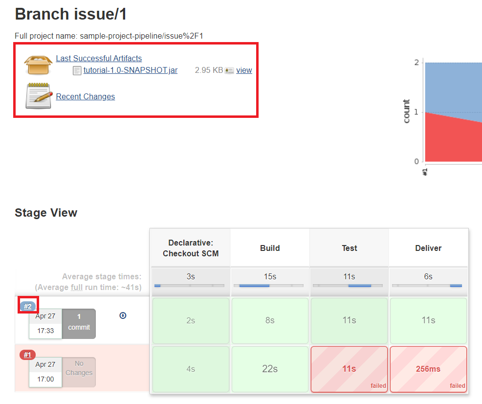

1. Now, go to `https://github.com/<ORGANIZATION ACCOUNT NAME>/sample-project-repo/tree/issue/1`. You will see that a `success` status in latest commit status.  
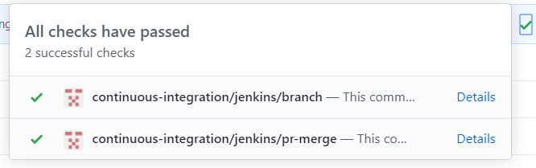

1. Now, also in the same `Browser_Admin` (i.e. using `<GITHUB_ADMIN_USER>` account), click on `Pull requests` at the top to see the pull requests list.  
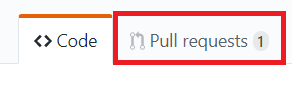

1. Now, you will see the pull requests list. Click on the open pull request.  
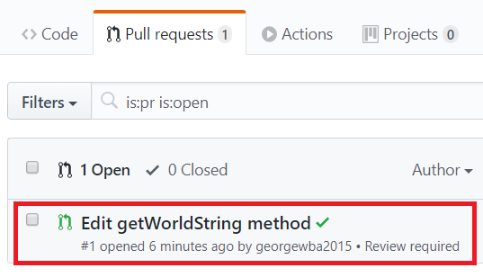

1. Now, click on `Add your review`.  
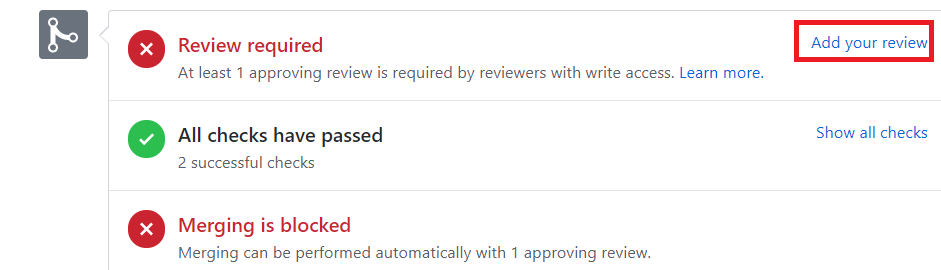

1. Then, click on `Review changes`. Then, write any comment in the comment field, and select `Approve`. Then, click on `Submit review`.  
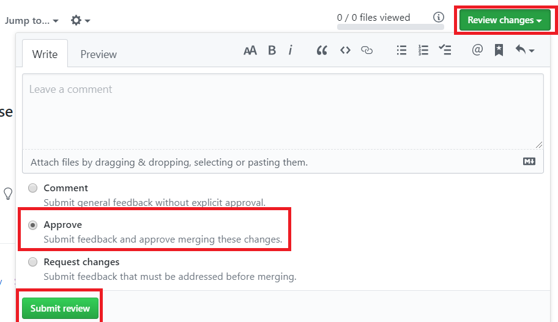

Now, `<GITHUB_ADMIN_USER>` have approved the pull request.

## Use `<GITHUB_WRITE_USER>` to merge the pull request.

Do the following steps:

1. Now, go to the other browser `Browser_Write` to see pull request from `<GITHUB_WRITE_USER>` account perspective. Then, go to `https://github.com/<ORGANIZATION ACCOUNT NAME>/sample-project-repo`{{copy}}. Now, we will merge the pull request using `<GITHUB_WRITE_USER>` account.

1. Now, click on `Pull requests` at the top to see the pull requests list.  


1. Now, you will see the pull requests list. Click on the open pull request.  


1. Now, you will see that `<GITHUB_WRITE_USER>` is now able to merge the pull request. Click on `Merge pull request`.  
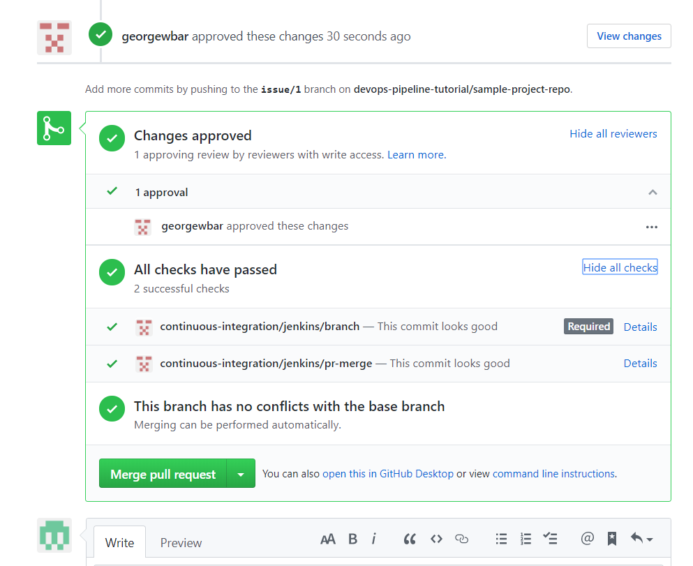

1. Then, click on `Confirm merge`.  
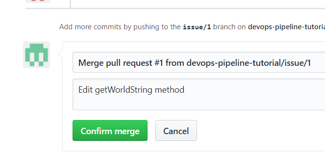

1. Now, go to `https://github.com/<ORGANIZATION ACCOUNT NAME>/sample-project-repo`{{copy}}.

1. Click on `Commits` in the top.  
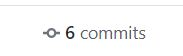

1. You will see now that the latest commit in the `master` branch that starts with `Merge pull request` will trigger Jenkins to build a new pipeline for `master` branch after `issue/1` branch was merged with it. And, after Jenkins is done, the commit status of the latest commit will be `success`.  
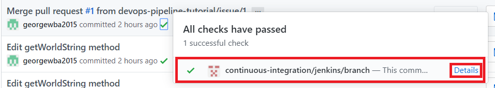
