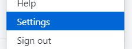
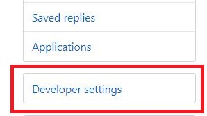
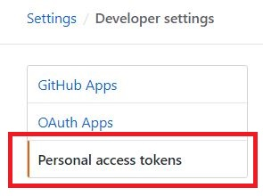
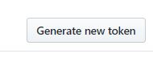
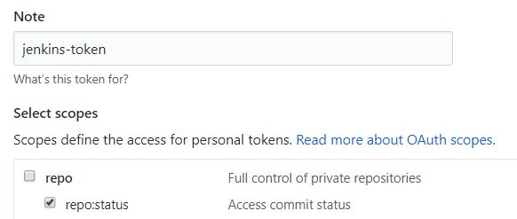
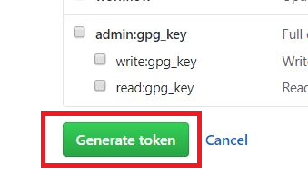
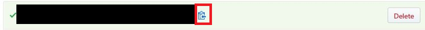

# Create a Personal Access Token on Github

Now, we will create a `personal access token` on Github and save it, to use it later configure Jenkins to use it to change the commit status of pull requests and new commits.

Do the following steps:

1. First, sign in to your Github account using `<GITHUB_ADMIN_USER>` if you are not already.

1. Then, click your profile icon in the upper right part of your screen. Then, select `Settings`.  

1. Then, click `Developer Settings` on the left.  

1. Then, click `Personal access tokens` on the left.  

1. Then, click `Generate new token` on the top right.  

1. Then, fill in the form. Write a meaningful `Note` for the token. I will choose `jenkins-token`. Then, select `repo:status` as the scope of this token, as this token is only needed by Jenkins to set and get the commit status.  

1. Then, click `Generate new token` at the bottom of the page.  

1. This step is **IMPORTANT**. A token was created and now you should see it. Click on the `Copy to clipboard` icon (marked in red). Then, go to your terminal now in Katacoda and execute `echo "<copied token>" > token`{{copy}}, where `<copied token>` should be replaced by the copied token. This command will create a file called token in your current directory and write `<copied token>` in it. For example, if the copied token is `abc123`, then you should replace `<copied token>` by `abc123`. This will result in a command `echo "abc123" > token` that you should execute. The idea is that we want to save this token locally on your Katacoda environment because we will need it later, and Github will not let you see the token again (Github will tell you at the top `Make sure to copy your new personal access token now. You won’t be able to see it again!`). Normally, you would delete the `token` file that was created when you do not need it anymore. Also, the created token should be removed from Github as well when you are done with this tutorial.

